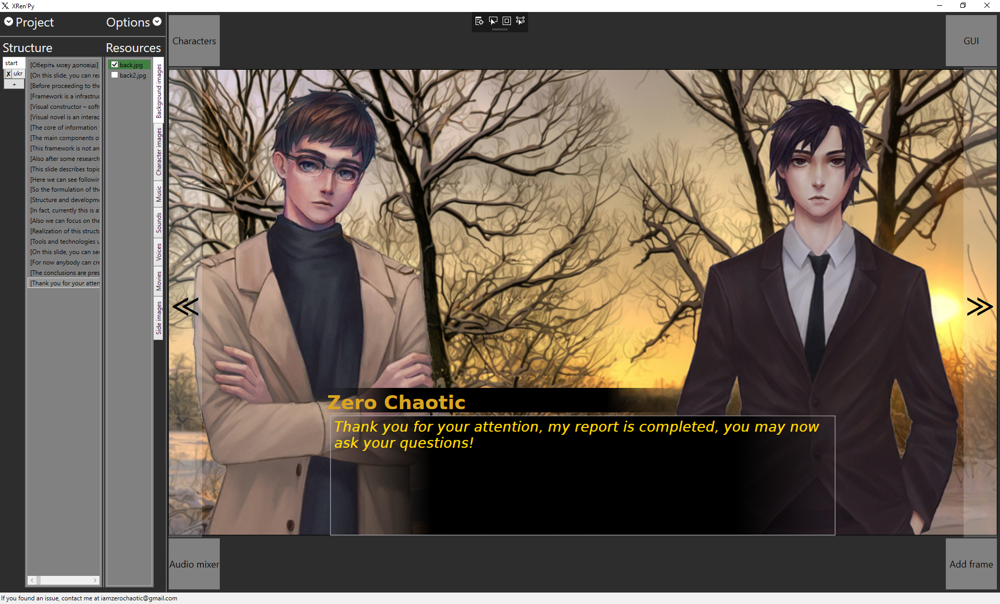

# XRen'Py

eXtended Ren'Py - visual editor for Ren'Py 7 (beta)

- Currently only Windows
- This application allows developers to create simple Ren'Py game without any knowledge of Python and Ren'Py scripting.
- Created with Visual Studio 2015, programming language C#, .NET framework, Windows Presentation Foundation, LINQ and XAML.
- Compatible with Ren'Py 7 projects only.

Now it is possible to intuitively create and export to Ren'Py project:
- Kinetic novels
- Sound novels
- Simple ADV novels

Currently released application features:
- project structure block with labels containing frames and customizable size
- project resources block with 6 types of resources and customizable size
- creating and deletion of labels with editable names
- creating, duplicating and deletion of frames - each frame name contains the text it shows
- converting frames to menus and backwards
- menu options - can be viewed as editable structures with actions they have to do or as in-game clickable objects, doing the jump or call of the particular label or passing to the next frame
- importing images, audio and movies to the novel (no duplicate check)
- adding images, audio and movies to the frame by checking them (backgrounds and movies - one per frame, only background)
- strict system of directories inside the project - now the content is where it has to be
- content collector - copying of the particular resource to the project folder when necessary
- media preview - if cursor is above any resource, the media preview window shows up, on leave it closes, on click freezes in opened state and, if the resource is present in currently selected frame, shows the parameters of this resource below it. Contains image viewer, music player with cover art and controls and movie player with the same controls
- images alignment and animation controls
- audio fades controls with value check, point or comma inside, up to 9.9 seconds floating point and 999 seconds integer of fade 
- view block - visual representation of the prototype of the future game, contains six buttons for converting menu to frame and backwards, adding next empty frame, duplicating current frame, GUI control and two control buttons to move to next or previous frame
- view block and project block size customizing
- mostly working saving, saving as and loading projects
- changing/creating options.rpy with all available options except build options
- changing/creating gui.rpy with colors and fonts available (connection as default is in process)
- you can add your own icon of project
- content can be reloaded if deleted
- menu can contain any images or music as any frame and correctly stop it in any other label you want to jump to
